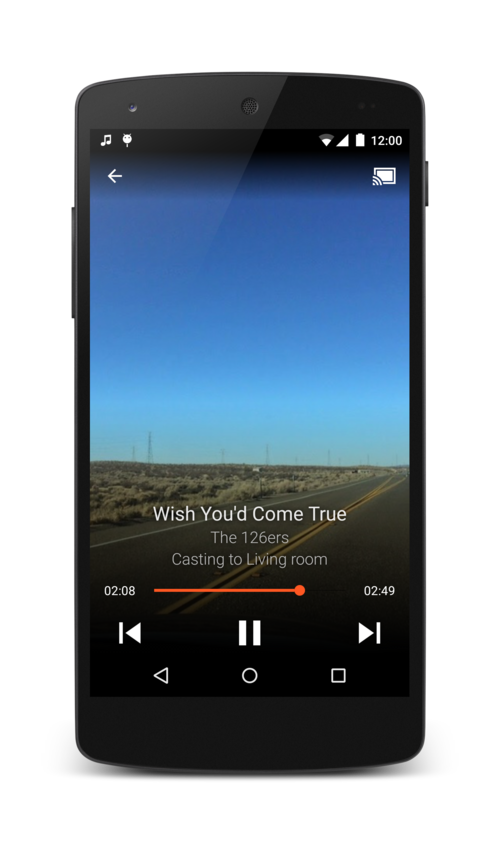
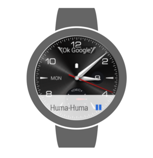
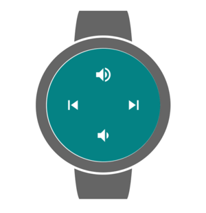

KNR Radio App
=====================================
This app is implemented to stream radio form http://kristennetradio.dk

Pre-requisites
--------------

- Android SDK v17

Getting Started
---------------

This sample uses the Gradle build system. To build this project, use the
"gradlew build" command or use "Import Project" in Android Studio.

Screenshots
-----------

Support
-------

If you've found an error, please report reproducable scene. Thank you!

License
-------

Code is strongly inpired form Androids Universial Player Sample.

You are welcome to use this code for your own purpose :-)
